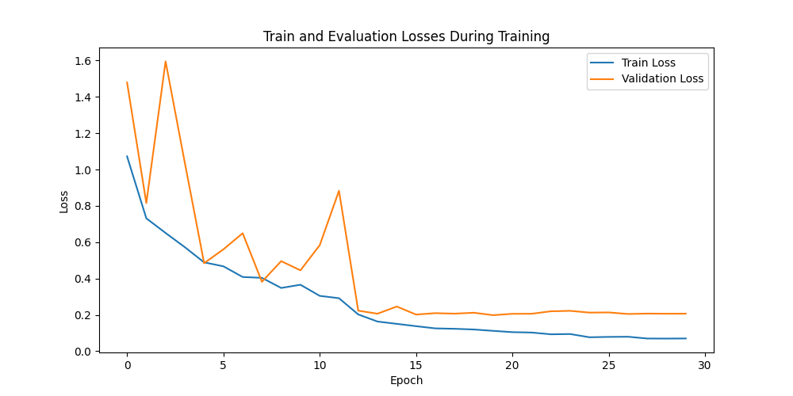

# PyTorch ResNet Image Classifier

This project implements a multiclass image classification pipeline in PyTorch. The classifier uses a ResNet-18 style architecture and is trained to classify images into six categories: bus, car, light, sign, truck, and vegetation.

The project includes utilities for dataset preparation, a custom PyTorch Dataset class, Albumentations-based image preprocessing and augmentation, training and validation loops, model checkpointing, learning-curve visualization, and an inference script that exports predictions to CSV.

## Classes

The model predicts one of the following classes:

| Class ID | Class |
|---|---|
| 0 | bus |
| 1 | car |
| 2 | light |
| 3 | sign |
| 4 | truck |
| 5 | vegetation |

## Model

The model is a custom ResNet-18 style convolutional neural network implemented in PyTorch. It is built from residual `BasicBlock` modules and adapted for six output classes.

## Attribution

The custom ResNet-18 implementation was adapted from the DebuggerCafe tutorial [Implementing ResNet18 in PyTorch from Scratch](https://debuggercafe.com/implementing-resnet18-in-pytorch-from-scratch/#download-code) and modified for this six-class image classification task.

## Project structure

```text
.
├── dataset.py
├── network.py
├── training.py
├── inference.py
├── learning_curves.png
├── model.pt
├── requirements.txt
├── README.md
└── sample_data/
    ├── bus/
    ├── car/
    ├── light/
    ├── sign/
    ├── truck/
    └── vegetation/
```

## Dataset format

The dataset is expected to be organized into class-specific folders:

```text
dataset/
├── bus/
├── car/
├── light/
├── sign/
├── truck/
└── vegetation/
```

Each folder should contain images belonging to that class.

The full training dataset is not included in this repository. Sample images are included. However, they are intended only to demonstrate the expected folder structure and to allow quick inference testing.

During training, the script splits the provided dataset into training and validation subsets using a 90/10 split.

## Requirements

Install the required dependencies:

```bash
pip install -r requirements.txt
```

Note: model architecture visualization with `torchview` may require Graphviz to be installed on the system.

## Usage

### Training

To train the model, run:

```bash
python training.py path/to/train_dataset
```

The training script:

- loads images from class-specific folders,
- applies preprocessing and augmentation,
- splits the data into training and validation subsets,
- trains the custom ResNet-18 model,
- saves the best model checkpoint based on validation loss,
- saves learning curves.

Generated training outputs:

```text
model.pt
learning_curves.png
model_architecture.png
```

### Inference

To run inference using a trained model checkpoint:

```bash
python inference.py path/to/test_dataset model.pt
```

To run inference on only the first `N` samples:

```bash
python inference.py path/to/test_dataset model.pt 100
```

Predictions are saved to:

```text
output_predictions/predictions.csv
```

The output CSV has the following format:

```text
filename,class_id
```

## Training results

The training and validation losses are shown below:



## Features

- Custom ResNet-18 style model implemented in PyTorch
- Custom `torch.utils.data.Dataset` class
- Optional train/test dataset preparation utility
- Albumentations preprocessing and augmentation
- 90/10 train-validation split
- Cross-entropy loss
- Optional class-weighted loss for imbalanced data
- Adam optimizer
- `ReduceLROnPlateau` learning-rate scheduler
- Model checkpointing based on validation loss
- Learning-curve plotting
- Inference script with CSV prediction output

## Generated files

Running the training and inference scripts may create the following outputs:

```text
model.pt
learning_curves.png
model_architecture.png
output_predictions/
```

These files can be excluded from version control if needed, except for files intentionally included to demonstrate model performance.
